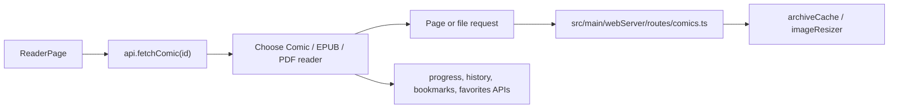

# Reader Guide

CB8 has three reader surfaces. `ReaderPage` chooses the reader from the comic
record's media type and extension:

- `src/renderer/components/reader/ComicReader.tsx` for CBZ / CBR.
- `src/renderer/components/reader/EpubReader.tsx` for EPUB.
- `src/renderer/components/reader/PdfReader.tsx` for PDF.

The shared page chrome lives in `ReaderToolbar.tsx`. Reader preferences are
stored in `src/renderer/store/readerStore.ts`.

## Comic Reader

Comic pages are fetched from `/api/comics/:id/pages/:page`. The server opens the
archive through `src/main/webServer/archiveCache.ts`, reads the page with
`src/main/archiveLoader.ts`, and optionally resizes it with
`src/main/imageResizer.ts`.

Useful entry points:

- `ComicReader.tsx` — rendering, toolbar state, bookmark/favorite actions.
- `src/renderer/hooks/useComicKeyboard.ts` — keyboard navigation.
- `src/renderer/hooks/useComicGestures.ts` — touch gestures.
- `src/shared/scaleFit.ts` — fit-width / fit-height math.

## EPUB Reader

EPUB files are served from `/api/comics/:id/file` and rendered with `epub.js`.
Theme-related helpers live in `src/shared/epubTheme.ts`.

Progress is stored as an EPUB location string with
`api.updateLocation(comicId, location)`.

## PDF Reader

PDF files are served from `/api/comics/:id/file` and rendered with `pdfjs-dist`.
The worker bundle is produced by the renderer build.

Progress is stored as a zero-based page index with
`api.updateProgress(comicId, page)`.

## Reader Data Flow

## Safe Places To Start

For small reader changes, start in this order:

1. `ReaderPage.tsx` if the change is about choosing a reader.
2. The specific reader component if the change is format-specific.
3. `readerStore.ts` if the change is a persistent preference.
4. `src/shared/scaleFit.ts` or another shared helper if the logic is pure and
   easy to unit test.
