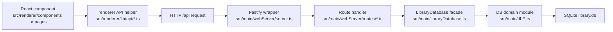
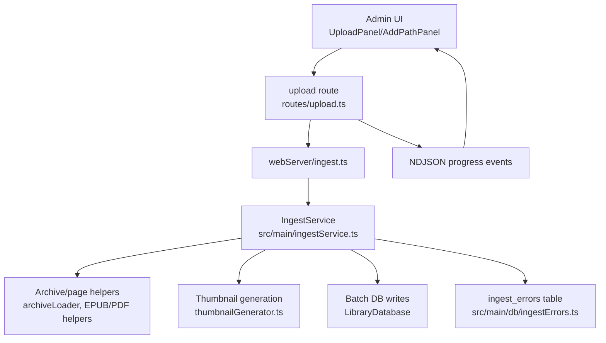
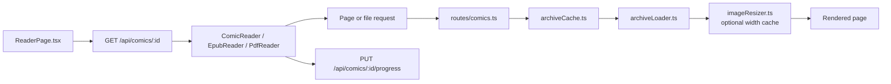

# CB8 Flow Diagrams

These diagrams are intentionally small. They are here to help new contributors
build a mental model before diving into files.

## Renderer To API To Database

## Upload And Ingest

## Reader Page/Image Flow

